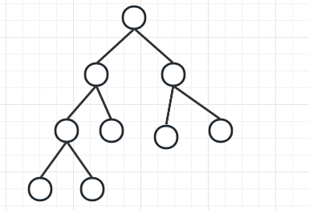
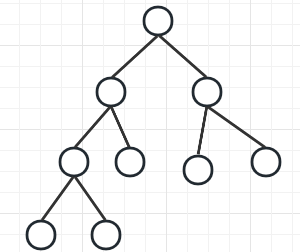
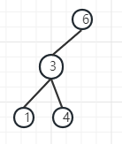
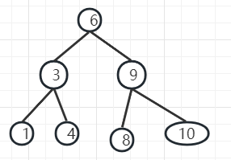
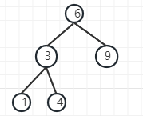

<h3>1.种类<h3/>
**满二叉树** 
完全饱满的二叉树
结点数量 num = 2^k -1; 

**完全二叉树** 
上层是饱满的，底部可以不是饱满的，但是必须是从左到右连续的。 

**二叉搜索树** 
对二叉树没有特别要求，对于顺序有要求，比父节点大的在右边，小的在左边。 

**平衡二叉搜索树** 
左子树和右子树高度差不能超过1 

<h3>2.存储方式<h3/>
顺序存储，采用数组，左孩子2x + 1; 右孩子2x + 2; 

链式存储 
class TreeNode{ 
    int val; 
    TreeNode left; 
    TreeNode right; 
} 

<h3>3.遍历方式<h3/>
深度优先遍历 
广度优先遍历

